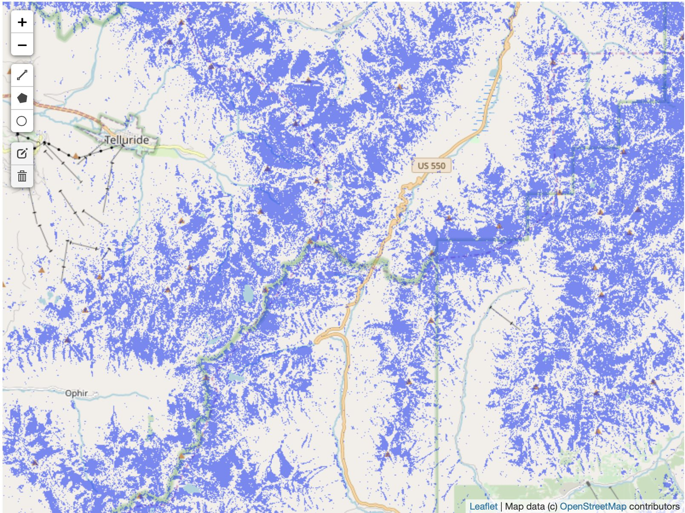

# gee-python-snowmelt
exploring radar wet snow maps with google earth engine python api



## To run:

### Get an account with google earth engine and initialize access with a token. See here:
https://github.com/google/earthengine-api/blob/master/python/examples/ipynb/authorize_notebook_server.ipynb

### install conda if you don't already have it:
https://conda.io/miniconda.html

### install necessary packages into python environment (jupyterlab, ipyleaflet, gee-python-api):
```
conda env create -f gee-python-snowmelt.yml
conda activate gee-python-snowmelt
jupyter labextension install jupyter-leaflet
jupyter labextension install @jupyter-widgets/jupyterlab-manager
```

### run notebook in jupyter lab!
```
jupyter lab
```
